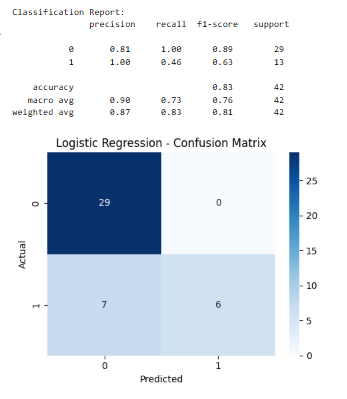
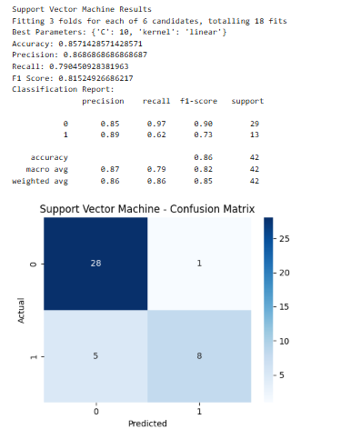
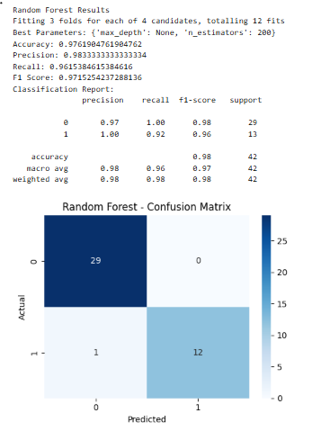
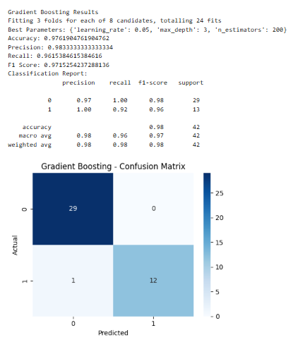
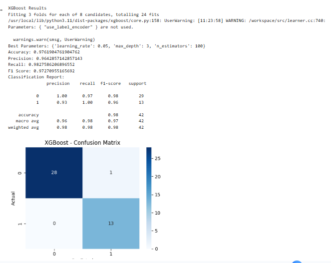
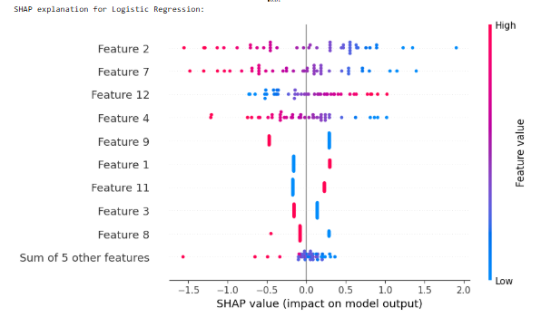

# Student Placement Prediction Using Machine Learning and XAI

## Overview
This project predicts student placement status using multiple machine learning models.  
It implements a complete machine learning workflow including data preprocessing, exploratory data analysis, model training, hyperparameter tuning, evaluation, and explainability using LIME and SHAP.

---

## Problem Statement
Predict whether a student will be **Placed** or **Not Placed** based on academic performance, background, and professional attributes, and explain the predictions using explainable AI techniques.

---

## Dataset
- **File:** Placement_Data_Full_Class.csv  
- **Type:** Tabular dataset  
- **Target Variable:** `status`
  - `Placed` → 0
  - `Not Placed` → 1

---

## Features

### Categorical Features
- `gender`
- `ssc_b`
- `hsc_b`
- `hsc_s`
- `degree_t`
- `workex`
- `specialisation`

### Numerical Features
- `ssc_p`
- `hsc_p`
- `degree_p`
- `etest_p`
- `mba_p`
- `salary`

---

## Data Preprocessing
- Dropped unnecessary column (`sl_no`)
- Removed duplicate records
- Checked missing values
- Imputed missing values in `salary` using median
- Removed outliers using IQR method for:
  - `hsc_p`
  - `degree_p`
- Label encoded categorical features
- Applied feature scaling using `StandardScaler` where required
- Performed stratified train-test split (80/20)

---

## Exploratory Data Analysis (EDA)
- Count plots for categorical variables
- Distribution plots for numerical features
- Placement analysis based on:
  - Gender
  - Higher secondary stream
  - Degree type
  - Work experience
  - Specialisation
- Boxplots for numerical features by placement status
- Correlation heatmap of numerical features

---

## Machine Learning Models
Models trained using **GridSearchCV (cv = 3)**:

- Logistic Regression
- K-Nearest Neighbors (KNN)
- Support Vector Machine (SVM)
- Random Forest Classifier
- Gradient Boosting Classifier
- XGBoost Classifier

Feature scaling applied for:
- Logistic Regression
- KNN
- SVM
- Gradient Boosting
- XGBoost

(Random Forest trained without scaling.)

---

## Model Evaluation
Models were evaluated using:
- Accuracy
- Precision (Macro)
- Recall (Macro)
- F1 Score (Macro)
- Confusion Matrix
- Classification Report

Confusion matrices were visualized using heatmaps.

---

## Explainable AI (XAI)

### LIME
- Used for local explanations
- Explains individual predictions
- Shows feature contribution for a selected test instance

### SHAP
- Used for global explanations
- Beeswarm plots show overall feature importance
- Applied on scaled training and test data

---
## Model Results and Explainability Outputs

This section presents visual outputs generated from different machine learning models and explainable AI techniques.

---

### Logistic Regression


---

### K-Nearest Neighbors (KNN)


---

### Support Vector Machine (SVM)


---

### Random Forest


---

### Gradient Boosting


---

### XGBoost


---

### LIME Explanation
The following visualization shows the local explanation of an individual prediction using LIME.


---

### SHAP Explanation
The following plot shows global feature importance using SHAP.



---


## Technologies Used
- Python
- Google Colab
- pandas
- numpy
- matplotlib
- seaborn
- scikit-learn
- xgboost
- lime
- shap

---

## How to Run
```bash
1. Open the notebook in Google Colab
2. Upload Placement_Data_Full_Class.csv
3. Run all cells sequentially
